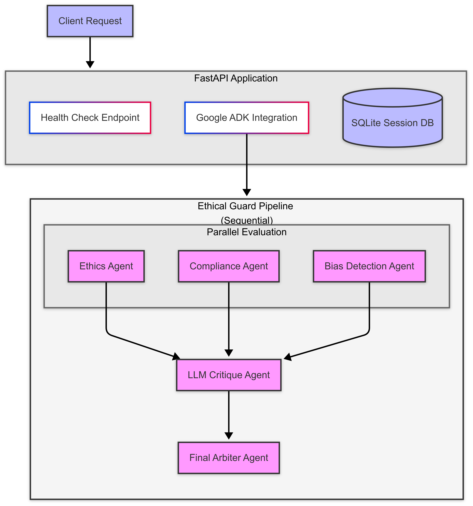

# EthicalGuard: A Multi-Agent Ethical AI Risk Evaluator

**Built for the Google Cloud ADK Hackathon 2025**

---

##  What Is EthicalGuard?

**EthicalGuard** is a multi-agent AI system designed to **analyze the ethical risks of any text or prompt** — such as one that might be used in an AI chatbot, marketing campaign, HR screening tool, or content generation pipeline.

> It helps organizations ensure their AI usage remains ethical, fair, unbiased, and legally compliant.

It uses **Google's Agent Development Kit (ADK)** and orchestrates **five intelligent agents**, each with a specific role. These agents collaborate like a human ethics review board — in seconds.

---

## Why We Built This

AI systems are being rapidly deployed — often without oversight. Whether it's bias in hiring, privacy violations in marketing, or unsafe chatbot behavior, organizations urgently need automated, auditable compliance checks.

We built EthicalGuard to:
- Provide a **fast, automatic** ethical compliance review
- Simulate **multi-role governance** using agent orchestration
- Demonstrate real-world AI safety use cases with Google ADK and Cloud

---

## Agent Workflow (Architecture)

The system follows a hybrid workflow combining parallel and sequential processing:

This architecture enables:
1. User input through the web interface to FastAPI
2. Parallel execution of Ethics, Compliance, and Bias analysis
3. Results aggregation by LLM Critique
4. Final safety classification by the Arbiter
5. Storage of results in SQLite DB
6. Integration with Google Cloud AI for all agent operations

## Architecture Diagram



### Agent Roles

- **Ethics Agent**: Flags potential ethical risks, manipulation, or harmful intent.
- **Compliance Agent**: Reviews for legal/policy violations (e.g., GDPR, EEOC).
- **Bias Detection Agent**: Detects social, racial, or gender bias in language.
- **LLM Critique Agent**: Evaluates hallucination, unsafe completions, or misuse.
- **Final Arbiter Agent**: Summarizes previous steps and delivers final assessment.

---

## Tech Stack

| Technology                  | Version/Details         | Purpose                                         |
|-----------------------------|------------------------|-------------------------------------------------|
| Python                      | 3.11                   | Core language                                   |
| google-adk                  | latest                 | Multi-agent orchestration framework             |
| google-cloud-aiplatform     | latest                 | AI/ML infrastructure and model serving          |
| google-cloud-bigquery       | latest                 | Data storage and analytics                      |
| pydantic                    | latest                 | Data validation and settings management         |
| python-dotenv               | latest                 | Environment configuration management            |

---

## Project Structure

```
ethical-agent/
├── ethical_complaince_agents/
│   ├── __init__.py
│   └── agent.py
├── .dockerignore
├── .gitignore
├── architecture.png
├── Dockerfile
├── LICENSE
├── main.py
├── README.md
├── requirements.txt
├── sessions.db
```

---

##  How to Run Locally

```bash
# 1. Install dependencies
python -m venv venv && source venv/bin/activate
pip install -r requirements.txt

# 2. Set your environment variables
cp .env.example .env
# Add your GOOGLE_API_KEY inside the .env file

# 3. Run the agent manually (for local dev)
Run adk web for web view


```
---

## Deploy to Cloud Run
  You can follow steps from here - 
  - https://cloud.google.com/sdk/docs/install
  - https://google.github.io/adk-docs/deploy/cloud-run/

```bash
gcloud run deploy $SERVICE_NAME  \
  --source . \
  --project=$GOOGLE_CLOUD_PROJECT \
  --region=$GOOGLE_CLOUD_LOCATION \
  --allow-unauthenticated \
  --set-env-vars="GOOGLE_CLOUD_PROJECT=$GOOGLE_CLOUD_PROJECT,GOOGLE_CLOUD_LOCATION=$GOOGLE_CLOUD_LOCATION,GOOGLE_GENAI_USE_VERTEXAI=True"
```

---

## Live Deployment

**Cloud Run API URL**: [https://adk-default-service-name-568661111547.us-east1.run.app/dev-ui/?app=ethical_complaince_agents](https://adk-default-service-name-568661111547.us-east1.run.app/dev-ui/?app=ethical_complaince_agents)

Access the live dev UI to test the ethical analysis system. Submit prompts to see how the multi-agent system evaluates them for ethical concerns, bias, and compliance issues.

## Example Prompts

Here are some example prompts that demonstrate the system's capabilities:

### Ethical AI Guidelines
* "What are best practices for ensuring AI models respect user privacy?"
* "How can we implement ethical data collection practices in our AI pipeline?"
* "What guidelines should we follow for fair AI recruitment tools?"

### Compliance Analysis
* "What are GDPR requirements for AI systems processing user data?"
* "How can we ensure our AI healthcare solution is HIPAA compliant?"
* "What are the legal guidelines for AI in financial services?"

### Bias Detection
* "Review this job description for potential unconscious bias"
* "Analyze this customer service script for cultural sensitivity"
* "Check these product recommendations for demographic fairness"


## Benefits of using Hybrid model

### Sequential-Only vs Sequential + Parallel (Hybrid) Agents

| Feature / Benefit            | **Sequential Only**                                 | **Sequential + Parallel (Hybrid)**                              |
| ---------------------------- | --------------------------------------------------- | --------------------------------------------------------------- |
| **Logic Flow**               | Agents run **one after another**, in strict order   | **Independent agents run simultaneously**, then converge        |
| **Speed / Performance**      | **Slower** – waits for each agent to finish         | **Faster** – parallel execution reduces overall latency         |
| **Token/Cost Efficiency**    | **Higher token cost** if early agents aren't reused | **Lower token use** — no waiting, no redundant outputs          |
| **Use Case Fit**             | Great for **dependent** logic (e.g. agent A → B)    | Ideal for **independent** evaluations (e.g. ethics, bias)       |
| **Modularity**               | More rigid — every step depends on the previous     | More **modular** — can plug/remove agents without breaking flow |
| **Accuracy**                 | Risks compounding errors from upstream agents       | Combines **multiple expert opinions**, increases reliability    |
| **Error Isolation**          | Errors propagate downstream                         | Errors are **isolated per agent** — easier to debug             |
| **Agent Specialization**     | Agents often handle broader logic                   | Agents can be **laser-focused**, increasing output quality      |
| **Real-world Scenarios**     | Good for pipelines like Chat → Summarize → Send     | Best for real-world: Compliance, Risk, Content, QA etc.         |
| **Scalability**              | Hard to scale horizontally                          | Easy to horizontally scale — spawn more parallel agents         |

## Hackathon Checklist

| Requirement                     | Status |
| ------------------------------- | ------ |
| Uses Google ADK (Python)        | Yes    |
| Multi-agent orchestration       | Yes    |
| Cloud Run deployed API          | Yes    |
| Public GitHub repo              | Yes    |
| Architecture Diagram            | Yes    |
| 3-minute demo video             | Pending|
| Original work, English language | Yes    |

---

## Learnings & Insights

* Orchestrated agents simulate **real-life ethical reviews**
* ADK made multi-agent reasoning intuitive and scalable
* FastAPI + Cloud Run delivered serverless ease
* Gemini Flash was efficient and responsive for real-time scoring

---

## Authors

### Team Members

**Arun Nathi** ([@akumarn74](https://github.com/akumarn74))
- Lead AI/ML Engineer & Architecture
- Agent System Design & Cloud Infrastructure

**Liakat Ali Mondol** ([@liakatmondol](https://github.com/liakatmondol))
- AI/ML Engineer
- Agent System Design & Implementation

*Built for the Google Cloud ADK Hackathon 2025*

### Acknowledgments
Special thanks to the Google ADK team for providing the tools and framework that made this project possible.

## Contributing
We welcome contributions! If you'd like to contribute:
1. Fork the repository
2. Create a feature branch
3. Submit a pull request with a clear description of your changes

## License
This project is licensed under the MIT License - see the LICENSE file for details.
